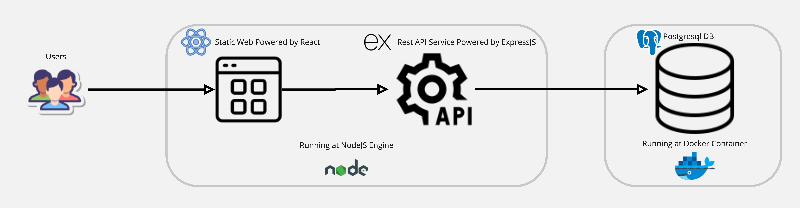

# my-todo-list-service-pact

A contract between a todo app frontend and backend in [open API specification yaml](./openapi.yaml). The purpose is enabling concorrent and independent frontend and backend development.

## Overall Tech Design

This diagram illustrates the overall tech design of the todo app, showcasing the interaction between the frontend and backend components.

## The Corresponding Repos

- React Front End: [My Todo List Frontend](https://github.com/addisonchan/my-todo-list-frontend)
- Expressjs and Postgresql DB Back End: [My Todo List Backend](https://github.com/addisonchan/my-todo-list-backend)

## Swagger Mock Service and Doc

A playground for the mock service and its document are hosted at the Swagger site [here](https://app.swaggerhub.com/apis/addisochan/todo-list-services/0.0.0#/default/addTodo). The mock service endpoint URL is published at:
`https://virtserver.swaggerhub.com/addisochan/todo-list-services/0.0.0/todos`
